##  🚀 Produtos MS
*  Sistema backend desenvolvido com Spring Boot para gerenciamento de produtos, com autenticação via OAuth2 (GitHub), persistência em PostgreSQL e versionamento de banco com Flyway.

## 📌 Visão Estratégica

O projeto foi construído com foco em:
#### 🔐 Segurança (OAuth2 + Spring Security)
#### 🧱 Arquitetura em camadas (Clean Architecture simplificada)
#### 🔄 Controle de versão de banco (Flyway)
#### 📦 Organização modular e escalável
#### 🚀 Pronto para evolução em microserviços

## 🧱 Arquitetura da Aplicação


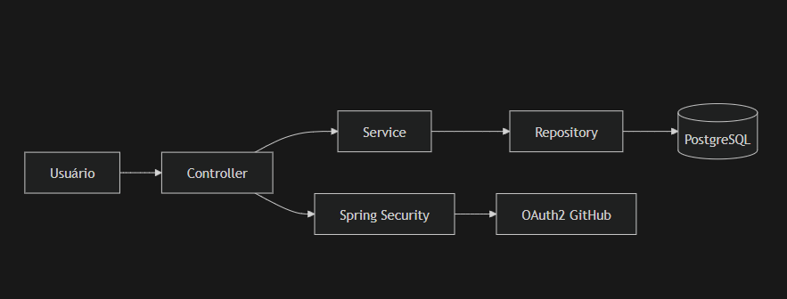


## 📂 Estrutura do Projeto
```
produtos-ms
├── .idea/                     # Configurações da IDE (não versionar)
├── .mvn/                      # Wrapper do Maven
│
├── docs/
│   └── evidencias/            # Evidências do sistema (prints e validações)
│       ├── arquitetura.png
│       ├── autenticacao.png
│       ├── autenticacao2.png
│       ├── cadastro_produto.png
│       ├── descricao_produtos.png
│       ├── login.png
│       ├── produtos_cadastrados.png
│       └── tela-inicial.png
│
├── src/
│   └── main/
│       ├── java/br/com/fiap/produtosms/
│       │   ├── configs/
│       │   │   └── SecurityConfig.java
│       │   │
│       │   ├── controller/
│       │   │   ├── CommonController.java
│       │   │   ├── HomeController.java
│       │   │   ├── ProdutoController.java
│       │   │   └── ProdutoApiController.java
│       │   │
│       │   ├── dto/
│       │   │   └── ProdutoDto.java
│       │   │
│       │   ├── entities/
│       │   │   ├── Produto.java
│       │   │   └── Usuario.java
│       │   │
│       │   ├── repositories/
│       │   │   ├── ProdutoRepository.java
│       │   │   └── UsuarioRepository.java
│       │   │
│       │   ├── service/
│       │   │   ├── ProdutoService.java
│       │   │   ├── ProdutoServiceImpl.java
│       │   │   └── CustomOAuth2UserService.java
│       │   │
│       │   ├── utils/
│       │   │
│       │   └── ProdutosMsApplication.java
│       │
│       └── resources/
│           ├── db/migration/
│           │   ├── V1__create_produto.sql
│           │   └── V2__insert_produtos.sql
│           │
│           ├── static/
│           │   └── css/
│           │       └── styles.css
│           │
│           ├── templates/
│           │   ├── 403.html
│           │   ├── detalhe-produto.html
│           │   ├── form-produto.html
│           │   ├── fragments.html
│           │   ├── index.html
│           │   ├── login.html
│           │   └── produtos.html
│           │
│           ├── application.properties
│           └── application-example.properties
│
├── target/                    # Build (não versionar)
├── .gitignore
├── docker-compose.yml
├── pom.xml
├── mvnw / mvnw.cmd
├── README.md
```

## ⚙️ Setup do Ambiente

🔹 1. Clone do projeto

- git clone https://github.com/alanerochaa/produtos-ms.git
- cd produtos-ms

🔹 2. Subir banco PostgreSQL (Docker)
```
docker run -d --name postgres-produtos \
-e POSTGRES_DB=produtosdb \
-e POSTGRES_USER=postgres \
-e POSTGRES_PASSWORD=postgres \
-p 5432:5432 postgres
```

🔹 3. Configuração do application.properties
```
spring.datasource.url=jdbc:postgresql://localhost:5432/produtosdb
spring.datasource.username=postgres
spring.datasource.password=postgres

spring.jpa.hibernate.ddl-auto=none
spring.jpa.show-sql=true

spring.flyway.enabled=true

spring.security.oauth2.client.registration.github.client-id=SEU_CLIENT_ID
spring.security.oauth2.client.registration.github.client-secret=SEU_CLIENT_SECRET
```

🔹 4. Execução
```
mvn spring-boot:run
```

```
http://localhost:8080
```

## 🔐 Acesso para avaliação

A aplicação pode ser acessada com o usuário de teste abaixo:

| Tipo de acesso | Usuário | Senha  |
|---|---------|--------|
| Login local | cliente | 123456 |

> Caso prefira, também é possível autenticar via GitHub, conforme configuração OAuth2 do projeto.


## 🔐 Segurança
* OAuth2 com GitHub
* Controle de rotas autenticadas
* Usuário identificado com:
   * Nome
    

## 🧪 Funcionalidades

| Feature              | Status |
| -------------------- | ------ |
| Login com GitHub     | ✅      |
| Cadastro de produto  | ✅      |
| Listagem de produtos | ✅      |
| Edição de produto    | ✅      |
| Exclusão de produto  | ✅      |
| Controle de acesso   | ✅      |
| Página 403           | ✅      |


## 🗃️ Banco de Dados

Versionamento com Flyway:

```
src/main/resources/db/migration
```

## 📸 Evidências de Execução do Sistema

## 🏠 Tela inicial
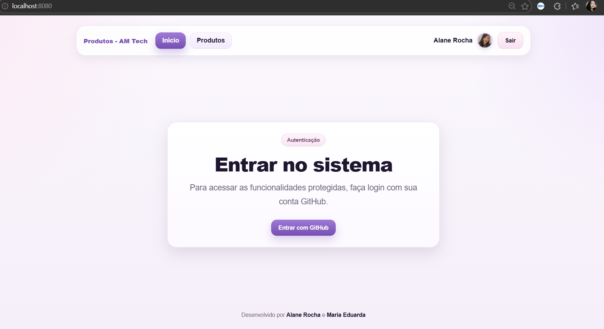

## 🔐 Autenticação
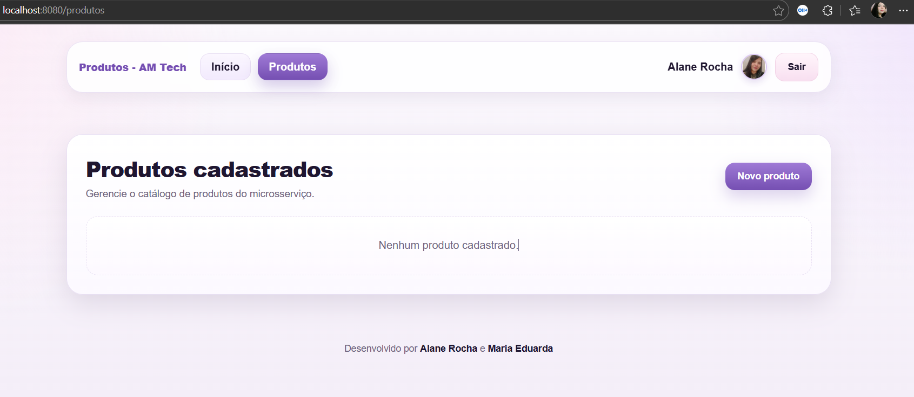
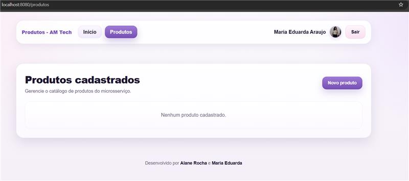

## 🔐 Login
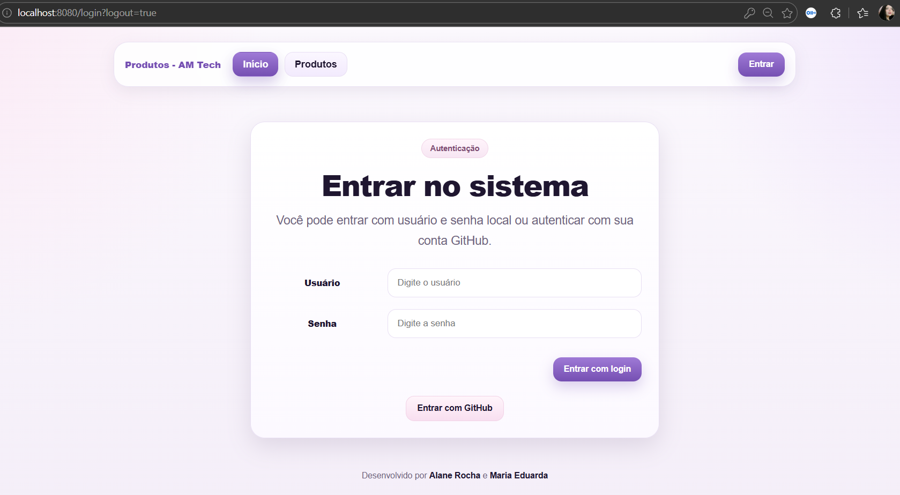

## ➕ Cadastro
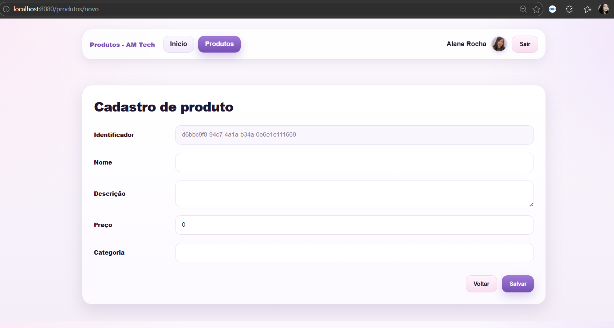
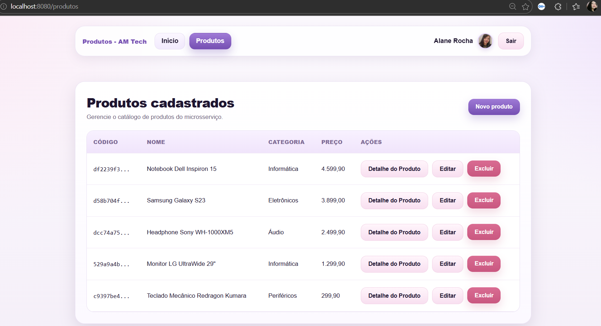
## 🔍 Detalhe
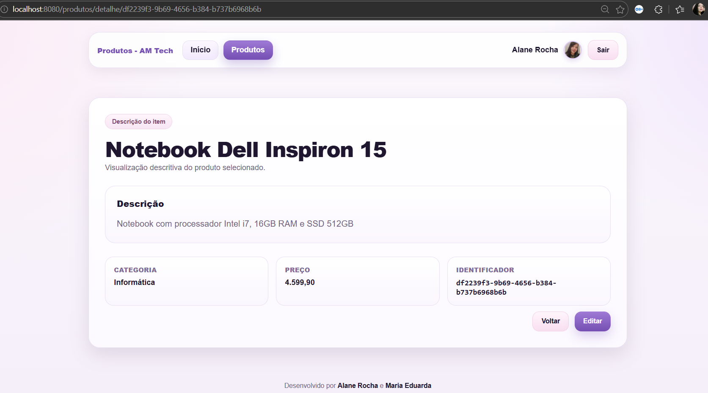

## bAnco
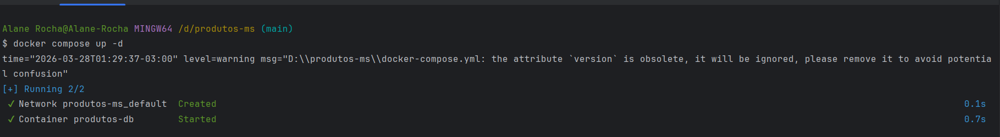
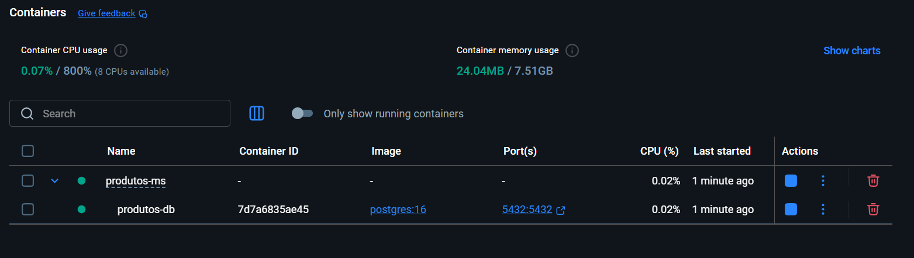

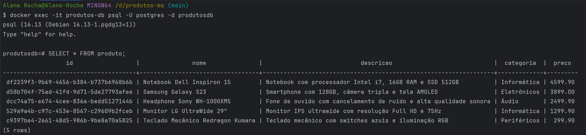
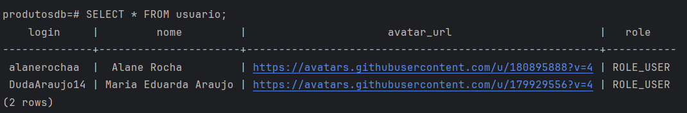

## 👩‍💻 Integrantes

| Nome          | RM       | Responsabilidade                                                       |
| ------------- | -------- | ---------------------------------------------------------------------- |
| Alane Rocha   | RM561052 | Desenvolvimento completo (Backend, regras de negócio, integração e UI) |
| Maria Eduarda | RM560944 | Desenvolvimento completo (Backend, regras de negócio, integração e UI) |
